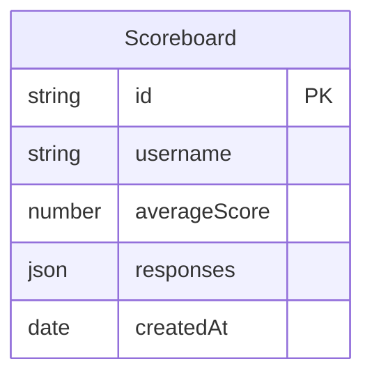

## Scoreboard Feature ERD

The Entity-Relationship Diagram above represents the scoreboard feature with the following entity:

### Scoreboard
- **id**: Unique identifier for the scoreboard entry
- **username**: Name or identifier of the player
- **score**: The player's score
- **responses**: Array of responses from the player
- **createdAt**: Timestamp when the score was recorded
