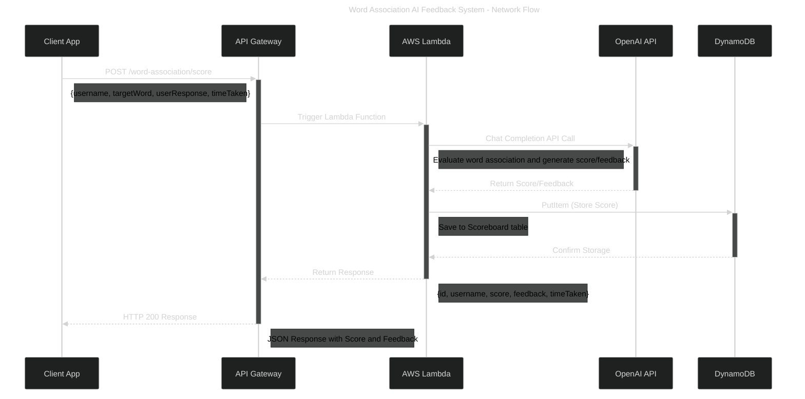

```mermaid
%%{init: {
  'theme': 'dark',
  'themeVariables': {
    'primaryColor': '#333',
    'primaryTextColor': '#fff',
    'primaryBorderColor': '#fff',
    'lineColor': '#fff',
    'secondaryColor': '#006100',
    'tertiaryColor': '#202020',
    'noteTextColor': '#000'
  }
}}%%

sequenceDiagram
    title Word Association AI Feedback System - Network Flow
    
    participant Client as Client App
    participant Gateway as API Gateway
    participant Lambda as AWS Lambda
    participant OpenAI as OpenAI API
    participant DB as DynamoDB

    Client->>+Gateway: POST /word-association/score
    Note right of Client: {username, targetWord, userResponse, timeTaken}
    
    Gateway->>+Lambda: Trigger Lambda Function
    
    Lambda->>+OpenAI: Chat Completion API Call
    Note right of Lambda: Evaluate word association and generate score/feedback
    
    OpenAI-->>-Lambda: Return Score/Feedback
    
    Lambda->>+DB: PutItem (Store Score)
    Note right of Lambda: Save to Scoreboard table
    
    DB-->>-Lambda: Confirm Storage
    
    Lambda-->>-Gateway: Return Response
    Note right of Lambda: {id, username, score, feedback, timeTaken}
    
    Gateway-->>-Client: HTTP 200 Response
    Note right of Gateway: JSON Response with Score and Feedback

    
    %% Use white arrows for better visibility on dark backgrounds
    
``` 