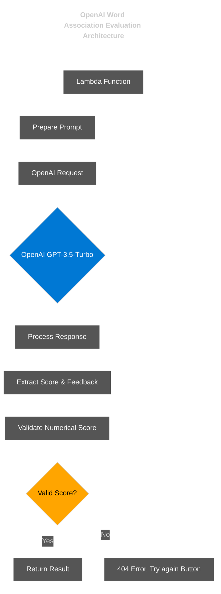

# OpenAI Architecture for Word Association Feedback

## Overview

The OpenAI integration provides AI-powered evaluation of word associations, delivering both numerical scores (1-10) and textual feedback. This architecture ensures reliable, consistent scoring through carefully structured prompts and robust parsing.

## Key Components

### 1. Prompt Engineering

```javascript
const messages = [
  {
    role: "system",
    content: "You are an expert evaluating word associations. Score responses on a scale of 1-10 based on creativity, relevance, and unexpectedness."
  },
  {
    role: "user",
    content: `Evaluate this word association:
    Target word: "${targetWord}"
    User response: "${userResponse}"
    
    Return your response in exactly this format:
    Score: [number between 1-10]
    Feedback: [2-3 sentences explaining the score]`
  }
]
```

### 2. Response Parsing

```javascript
function parseAIResponse(responseText) {
  // Extract numerical score with regex
  const scoreMatch = responseText.match(/Score:\s*(\d+)/i);
  let score = 5; // Default score
  
  if (scoreMatch && scoreMatch[1]) {
    score = parseInt(scoreMatch[1]);
    // Validate score is in range 1-10
    score = Math.max(1, Math.min(10, score));
  }
  
  // Extract feedback text
  const feedbackMatch = responseText.match(/Feedback:\s*(.*?)($|\n\n)/s);
  let feedback = "No feedback available";
  
  if (feedbackMatch && feedbackMatch[1]) {
    feedback = feedbackMatch[1].trim();
  }
  
  return { score, feedback };
}
```

### 3. Model Configuration

| Parameter | Value | Purpose |
|-----------|-------|---------|
| model | "gpt-3.5-turbo" | Best balance of cost/performance |
| temperature | 0.3 | Lower value for more consistent scoring |
| max_tokens | 150 | Sufficient for score and brief feedback |
| presence_penalty | 0 | Standard response generation |

## Reliability Measures

1. **Structured Format**: The prompt explicitly requests a numerical score followed by feedback
2. **Robust Parsing**: Regex-based extraction handles variations in response format
3. **Default Values**: Fallback mechanism if parsing fails
4. **Score Validation**: Ensures the extracted score is a valid number between 1-10

## Error Handling

```javascript
try {
  const aiResponse = await openai.chat.completions.create({/*...*/});
  const { score, feedback } = parseAIResponse(aiResponse.choices[0].message.content);
  return { score, feedback };
} catch (error) {
  console.error('Error calling OpenAI:', error);
  return {
    score: 5,
    feedback: "Unable to evaluate response due to a technical error. Default score provided."
  };
}
```

This architecture ensures the OpenAI integration reliably provides numerical scores rather than just qualitative feedback, making it suitable for the word association scoring system. 