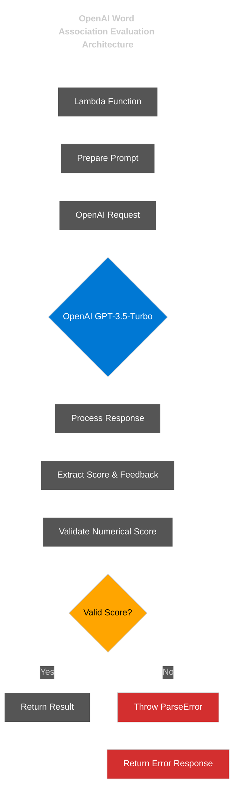

# OpenAI Architecture for Word Association Feedback

## Overview

The OpenAI integration provides AI-powered evaluation of word associations, delivering both numerical scores (1-10) and textual feedback. This architecture ensures reliable, consistent scoring through carefully structured prompts and robust parsing.

## Key Components

### 1. Configuration

```javascript
// Model configuration
const MODEL_CONFIG = {
  model: "gpt-3.5-turbo",
  max_tokens: 150,
  temperature: 0.3,
  presence_penalty: 0
};

// Prompt templates
const SYSTEM_PROMPT = "You are an expert evaluating word associations. Score responses on a scale of 1-10 based on creativity, relevance, and how well they incorporate the two provided words.";

// Template function for generating user prompt
function createUserPrompt(wordSet, userResponse) {
  const [word1, word2] = wordSet;
  return `Evaluate this word association response:
  Word Set: "${word1}" and "${word2}"
  User response: "${userResponse}"
  
  The user was asked to create a response that incorporates both words from the word set.
  
  Return your response in exactly this format:
  Score: [number between 1-10]
  Feedback: [2-3 sentences explaining the score]`;
}
```

### 2. Response Parsing with Error Handling

```javascript
// Custom error class for parsing failures
class AIParseError extends Error {
  constructor(message, responseText) {
    super(message);
    this.name = 'AIParseError';
    this.responseText = responseText;
  }
}

function parseAIResponse(responseText) {
  // Extract numerical score with regex
  const scoreMatch = responseText.match(/Score:\s*(\d+)/i);
  
  // Throw error if no score found
  if (!scoreMatch || !scoreMatch[1]) {
    throw new AIParseError(
      'Failed to extract numerical score from AI response', 
      responseText
    );
  }
  
  // Parse and validate score
  const score = parseInt(scoreMatch[1]);
  
  // Ensure score is in valid range
  if (isNaN(score) || score < 1 || score > 10) {
    throw new AIParseError(
      `Invalid score value: ${scoreMatch[1]}. Must be between 1-10.`, 
      responseText
    );
  }
  
  // Extract feedback text
  const feedbackMatch = responseText.match(/Feedback:\s*(.*?)($|\n\n)/s);
  let feedback = "";
  
  if (!feedbackMatch || !feedbackMatch[1]) {
    throw new AIParseError(
      'Failed to extract feedback from AI response', 
      responseText
    );
  }
  
  feedback = feedbackMatch[1].trim();
  
  return { score, feedback };
}
```

### 3. Implementation

```javascript
async function evaluateWordAssociation(wordSet, userResponse) {
  try {
    // Call OpenAI API with consolidated configuration
    const aiResponse = await openai.chat.completions.create({
      ...MODEL_CONFIG,
      messages: [
        {
          role: "system",
          content: SYSTEM_PROMPT
        },
        {
          role: "user",
          content: createUserPrompt(wordSet, userResponse)
        }
      ]
    });

    // Parse the response
    try {
      const { score, feedback } = parseAIResponse(aiResponse.choices[0].message.content);
      return {
        success: true,
        score,
        feedback
      };
    } catch (parseError) {
      // Handle parsing errors specifically
      console.error('Error parsing AI response:', parseError);
      
      // Return specific error for parsing failures
      return {
        success: false,
        errorType: 'PARSE_ERROR',
        errorMessage: parseError.message,
        originalResponse: parseError.responseText
      };
    }
  } catch (apiError) {
    // Handle API errors
    console.error('Error calling OpenAI API:', apiError);
    
    return {
      success: false,
      errorType: 'API_ERROR',
      errorMessage: apiError.message
    };
  }
}
```

## Expected Outputs

### Successful Response

```javascript
// Example input
const wordSet = ["ocean", "tree"];
const userResponse = "The palm trees swayed gently as waves from the ocean crashed onto the sandy shore.";

// Example OpenAI raw response
const rawResponse = `
Score: 9
Feedback: This response excellently incorporates both "ocean" and "tree" words in a coherent and creative sentence. The response creates a vivid coastal scene with palm trees near the ocean, showing a natural relationship between the two concepts. The imagery is detailed and demonstrates a strong understanding of how these elements might naturally coexist in a beach environment.
`;

// Expected parsed output
const successOutput = {
  success: true,
  score: 9,
  feedback: 'This response excellently incorporates both "ocean" and "tree" words in a coherent and creative sentence. The response creates a vivid coastal scene with palm trees near the ocean, showing a natural relationship between the two concepts. The imagery is detailed and demonstrates a strong understanding of how these elements might naturally coexist in a beach environment.'
};
```

### Low-Score Example

```javascript
// Example input
const wordSet = ["book", "mountain"];
const userResponse = "I read a book yesterday. Mountains are tall.";

// Example OpenAI raw response
const rawResponse = `
Score: 3
Feedback: While this response includes both "book" and "mountain" words as required, it does so in two disconnected sentences without creating any meaningful relationship between them. The response lacks creativity and simply states two unrelated facts. To score higher, the response should integrate both concepts into a coherent thought that shows how they might relate to each other.
`;

// Expected parsed output
const lowScoreOutput = {
  success: true,
  score: 3,
  feedback: 'While this response includes both "book" and "mountain" words as required, it does so in two disconnected sentences without creating any meaningful relationship between them. The response lacks creativity and simply states two unrelated facts. To score higher, the response should integrate both concepts into a coherent thought that shows how they might relate to each other.'
};
```

### Error Response Examples

```javascript
// Parsing error example
const parseErrorOutput = {
  success: false,
  errorType: 'PARSE_ERROR',
  errorMessage: 'Failed to extract numerical score from AI response',
  originalResponse: 'This is a great association between the words!'
};

// API error example
const apiErrorOutput = {
  success: false,
  errorType: 'API_ERROR',
  errorMessage: 'Request failed with status code 429: Rate limit exceeded'
};
```

## Reliability Measures

1. **Centralized Configuration**: All model parameters and prompts defined in one place
2. **Template Functions**: Reusable functions for generating prompts
3. **Strict Parsing**: Throws specific errors when format doesn't match expectations
4. **Custom Error Types**: Different error types for API failures vs parsing failures
5. **Detailed Error Information**: Preserves the original response for debugging

This architecture follows DRY principles by:
1. Defining configuration values only once
2. Using template functions for prompts
3. Separating concerns between configuration, parsing, and API calls
4. Creating a consistent error handling structure

The implementation ensures the OpenAI integration either returns a valid score or a clear error message that can be properly handled by the application. 